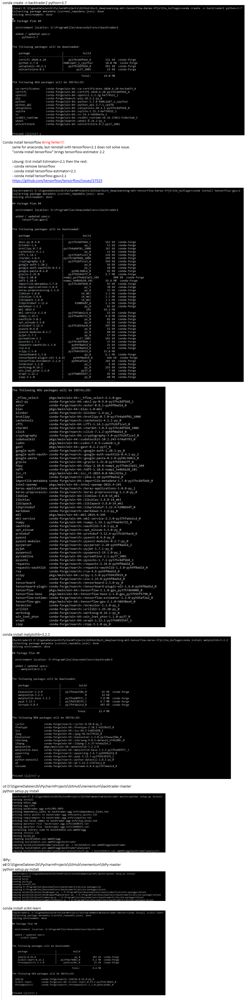

First install Backtrader
- https://github.com/mementum/backtrader
- cd D:\EigeneDateien2b\PycharmProjects\GitHub\mementum\backtrader-master
python setup.py install

conda create -n backtrader2 python=3.7
	

Conda install tensorflow Bring fehler!!!
	same for anaconda, but reinstall with tensorflow=2.1 does not solve issue.
	"conda install tensorflow" brings tensorflow-estimator 2.2
	
	Lösung: Erst install Estimator=2.1 then the rest:
	- conda remove tensorflow
	- conda install tensorflow-estimator=2.1
	- conda install tensorflow-gpu=2.1
	https://github.com/tensorflow/tensorflow/issues/37525
	
	
	
	

conda install matplotlib=3.2.2
	
	
cd D:\EigeneDateien2b\PycharmProjects\GitHub\mementum\backtrader-master
python setup.py install
	

IBPy:
cd D:\EigeneDateien2b\PycharmProjects\GitHub\mementum\IbPy-master
python setup.py install
	

conda install scikit-learn
	
